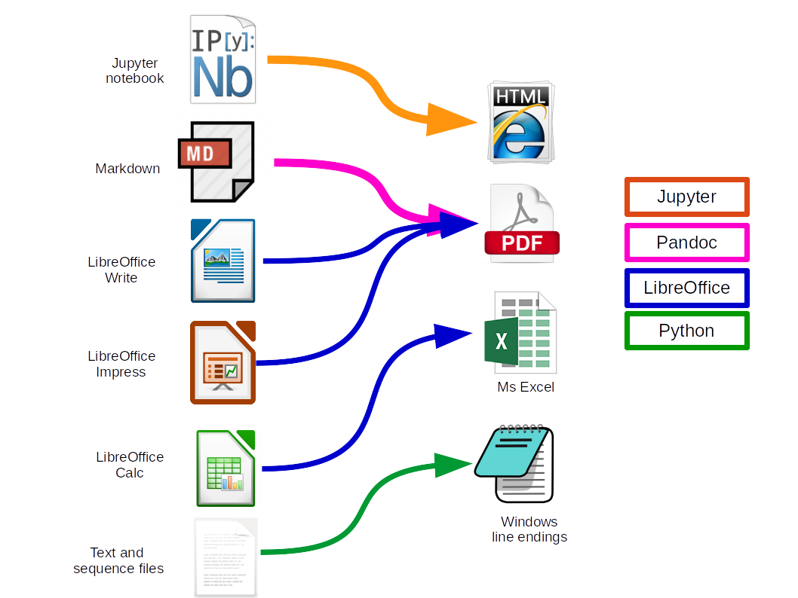

This repository shows how to distribute course files to students using Github and TravisCI.

I teach courses mostly in molecular biology and biotechnology. 
My computer runs Ubuntu linux, and I use the LibreOffice (LO) package, while my students mostly use Windows or Macs with Ms Office.
This means that files that I make are not always compatible with the software my students run. 
I can make PDFs manually from LO, but then I would have to keep track of two sets of files.
I also like ot keep files that I do not share with students. The TravisSlideProcessor ignores files and folders with names starting with "." or "_". 
 
# My Awesome Course 2016-17

Course:
- [Licenciatura em Biologia Aplicada 2yr](http://www.bio.uminho.pt/Default.aspx?tabid=7&pageid=112&lang=pt-PT)

Time & place:
  
- Monday  LABI DB Practical class
- Tuesday CP3 305 Theoretical 11:00 - 12:00
- Tuesday CP3 305 TP1 (TP Turno 1) 12:00 - 13:00
- Tuesday Lab informática CPII TP2 (TP Turno 2) 17:00 - 18:00

Teacher: 
- Björn Johansson <bjorn_johansson@bio.uminho.pt>

Delegad(o/a): 
- Maria Aluna

Course file dropbox [here](https://www.dropbox.com/sh/a4vwd1ux8h81mg8/AADceqVoh96TOCaNwUZvI976a?dl=0).

Course literature: 
- [GENE CLONING AND DNA ANALYSIS An Introduction T.A. BROWN 7ed](http://bcs.wiley.com/he-bcs/Books?action=index&bcsId=9980&itemId=1119072573)

Calendar:

<iframe src="https://calendar.google.com/calendar/embed?mode=WEEK&amp;height=600&amp;wkst=2&amp;bgcolor=%23FFFFFF&amp;src=e2fuohav3fujq4fu83ea6orbkk%40group.calendar.google.com&amp;color=%2329527A&amp;ctz=Europe%2FLisbon" style="border-width:0" width="800" height="600" frameborder="0" scrolling="no"></iframe>

Extra literature:

- [Molecular Biology of the Cell 4ed (free)](https://www.ncbi.nlm.nih.gov/books/NBK21054/)
- [Bioinformatics for Dummies - 2007](http://eu.wiley.com/WileyCDA/WileyTitle/productCd-0470089857.html)
- [Lehninger Principles of Bichemistry](https://www.amazon.com/Lehninger-Principles-Biochemistry-David-Nelson/dp/1429234148)
- [Stryer Biochemistry (5ed free)](https://www.ncbi.nlm.nih.gov/books/NBK21154/)
- [The Selfish Gene](https://www.amazon.com/Selfish-Gene-Popular-Science/dp/0192860925/ref=cm_cr_arp_d_product_top?ie=UTF8)

## How it works

These files and folders are stored in a repository on [Github](https://github.com).
On pushing file to the repository, automatic conversions are carried out as depicted in the figure below.

Except for the README.md, which is converted to html.

After processing, all files and folders are pushed to a dropbox.
The process looks like this:

1. TravisCI clones the repository.
2. git rev-list HEAD gives a list of all SHA1 sums of all commits.
3. The last commit that was processed by TravisCI is read from the cached (by TravisCI) file cached_sha1_checksum/last.sha1
4. git diff --name-only oldsum, newsum is used to find a list of all files changed since last time travis was run.
5. Files that does not exist or that have a name or folder that begins with a "_" are removed from the list.
6. Files are converted
7. The files in the list (or converted files) are pushed to a shared dropbox.

## Setup

1. You need Git installed on your local computer.
2. You need a Github account.
3. You need a TravisCI account.
4. Fork this repository to you own account.
5. Activate builds for the forked repository on TravisCI
6. [Create a dropbox app and an access token](http://www.iperiusbackup.net/en/create-dropbox-app-get-authentication-token/)
7. Copy the token (a long string of characters) and create an environment variable in TravisCI
8. Change the url of the build status badge on this page.
9. Create a folder on your dropbox that reflects the FOLDERLOCATION variable in ´.continuous_integration/convert_and_send.py´
10. Test the conversion by trigger a build at TravisCI or pushing files to the repository

 
