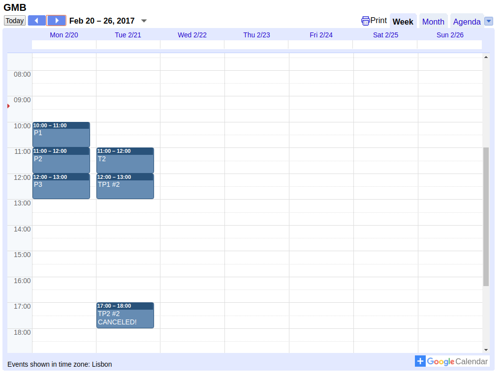

# AutoSlideProcessor

This repository contains code to automatically convert and distribute course files to students 
using a combination of Git, Github, TravisCI (or some other continuous integration service) and Dropbox.
These are a combination of free open source software tools and services currently offered for free.

## Motivation

I teach courses mostly in molecular biology and biotechnology at 
university level and I would like to share files such as slides and sequence files with my students.

My computer runs [Ubuntu](https://www.ubuntu.com/) linux, and I use the [LibreOffice](https://www.libreoffice.org/download/download/) (LO) 
package to create most content, while my students mostly use Windows or Macs with Microsoft Office.

This means that files that I make are not always compatible with the software my students run. 
One solution is to create pdfs from the LO files which can be read by anyone with a pdf reader. 
I could make PDFs manually from LO, but then I would have to keep track of two sets of files.

## What does AutoSlideProcessor do?

AutoSlideProcessor converts files in a Git repository on [Github](https://github.com) (like this one). 
Files in the directory tree are collected and converted to other formats according to the scheme below. 

An exception to the markdown->pdf rule is the README.md (this file), which is converted to html since 
it is meant to be a landing page for the course (see further down on this page).

The converted files are sent to a dropbox which can be made accessible to students. 
See the files from this repository by using the "Course file dropbox" link below.

New or changed content files (slides, handouts etc.) should be committed to a local copy of the Git repository.
These changes should be pushed to a remote Github repository. 
This can be a private repository if you want to keep the source files secret. 
When changes are pushed to Github, TravisCI is activated and converts the files.
After processing, the commit checksum is saved for next processing so that only files changed since are processed to save time.
This means that not every local commit has to be pushed to remote.

The AutoSlideProcessor ignores files and folders with names starting 
with "." or "_" which I use to keep some files from the students (like work in progress).

The process looks like this in detail:

1. TravisCI clones the repository.
2. git rev-list HEAD gives a list of all SHA1 sums of all commits.
3. The last commit that was processed by TravisCI is read from the cached (by TravisCI) file cached_sha1_checksum/last.sha1
4. git diff --name-only oldsum, newsum is used to find a list of all files changed since last time travis was run.
5. Files that does not exist or that have a name or folder that begins with a "_" are removed from the list.
6. Files are converted
7. The files in the list (or converted files) are pushed to a shared dropbox.

## Setup

1. You need Git installed on your local computer.
2. You need a Github account.
3. You need a TravisCI account.
4. Fork this repository to you own account.
5. Activate builds for the forked repository on TravisCI
6. [Create a dropbox app and an access token](http://www.iperiusbackup.net/en/create-dropbox-app-get-authentication-token/)
7. Copy the token (a long string of characters) and create an environment variable in TravisCI
8. Change the url of the build status badge on this page.
9. Create a folder on your dropbox that reflects the FOLDERLOCATION variable in ´.continuous_integration/convert_and_send.py´
10. Test the conversion by trigger a build at TravisCI or pushing files to the repository

See below for an example of how the README.md file can be used as a landing page for the course. 
In this example, an embedded google calendar is used to as a course schedule.

 
## MyCourse 2016-17

Course:
- [Licenciatura em Biologia Aplicada 2yr](http://www.bio.uminho.pt/Default.aspx?tabid=7&pageid=112&lang=pt-PT)

Time & place:
  
- Monday  LABI DB Practical class
- Tuesday CP3 305 Theoretical 11:00 - 12:00
- Tuesday CP3 305 TP1 (TP Turno 1) 12:00 - 13:00
- Tuesday Lab informática CPII TP2 (TP Turno 2) 17:00 - 18:00

Teacher: 
- Björn Johansson <bjorn_johansson@bio.uminho.pt>

Delegad(o/a): 
- Maria Aluna

Course file dropbox [here](https://www.dropbox.com/sh/9tfgot6mkjq7xcc/AABY5kZPJ7j8OgeMNeIb0JtSa?dl=0).

Course literature: 
- [GENE CLONING AND DNA ANALYSIS An Introduction T.A. BROWN 7ed](http://bcs.wiley.com/he-bcs/Books?action=index&bcsId=9980&itemId=1119072573)

Calendar:

Extra literature:

- [Molecular Biology of the Cell 4ed (free)](https://www.ncbi.nlm.nih.gov/books/NBK21054/)
- [Bioinformatics for Dummies - 2007](http://eu.wiley.com/WileyCDA/WileyTitle/productCd-0470089857.html)
- [Lehninger Principles of Bichemistry](https://www.amazon.com/Lehninger-Principles-Biochemistry-David-Nelson/dp/1429234148)
- [Stryer Biochemistry (5ed free)](https://www.ncbi.nlm.nih.gov/books/NBK21154/)
- [The Selfish Gene](https://www.amazon.com/Selfish-Gene-Popular-Science/dp/0192860925/ref=cm_cr_arp_d_product_top?ie=UTF8)

 
