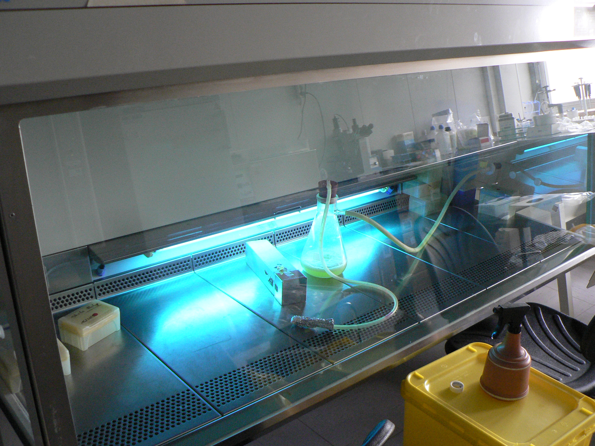

# Microbial Work
UC: Introduction to Microbiology

Course: Master in Biological Engineering, 2nd year

Teacher: Björn Johansson

School year 2016/2017

## General safety rules

1. Always use a clean labcoat.
2. Do not eat, drink or smoke in the laboratory.
3. NEVER pipette by mouth.
4. Keep your lab space clean and organized. Sterilize with 70% (v/v)
ethanol when needed.
5. Wash hands at the beginning and end of each lab session
6. Keep the Bunsen burners and alcohol lamps burning only when needed
7. Identify all material with name, date, class, “Turno” group number.
Use markers for apropriate for glass

## Laboratory notebook

The laboratory notebook is a scientific journal in which all information should be taken down. It should be a notebook, not single sheets, all pages should be numbered and dated. All information must be written with a permanent pen (not a pencil!). If you need to change something, cross over  the old information.

All relevant information should be registered. Probably more details than you think! A skilled person should be able to repeat the experiment using you notes. You should also be able to understand what you did next month or ten years from now.

If available note information about the reagents (reference and batch) and on equipment used type and name Results obtained (and expected) and conclusions! The laboratory notebook is not individual property in many laboratories but a proerty of the laboratory.

## Introduction

Since ancient times our ancestors unknowingly used microorganisms to manufacture  numerous foods that are still part of our everyday diet. Examples are bread, wine, beer and yogurt. Recombinant DNA technologies has expanded the range of products to many substances that bring benefits to society, including production antibiotics, vaccines, biodegradable plastics, etc. Some species of microorganisms can be harmful to human health or can cause food spoilage.

Due to its small size, microorganisms are generally not detectable with the naked eye at least not individually. The detection of microorganisms  in various habitats can be verified by growth under  favorable conditions, forming populations (for example colonies on solid medium) that are easily observable.

Since microorganisms are everywhere, there is a need to adopt certain common  procedures specific to microbiology work, which you will  will learn in this course. 

Cultivating microorganisms in the laboratory is essential for their isolation and characterization from both morphological point of view and also for studying their physiological and biochemical characteristics, and genetics.

### Disinfection and Sterilization

Microbes present in many different environments, such as in air,  soil or water. In order to prevent contamination of microbial cultures  material such as media and glassware needs to be sterile and aseptic techniques  needs to be implemented for the work.

**Disinfection** of a particular object or environment, is the destruction, inhibition  or removal of microbes. Vegetative cells are removed in this process but spores are not inactivated.

Household cleaners such as ammonia and bleach, are disinfectants. Household  disinfectants,mostly, they are strong oxidizing agents. Soaps, bile salts and phenols act by change the surface tension at the interface cell / medium. Ethylene oxide, glutaraldehyde or formaldehyde are commonly used  chemical agents. Other agents such as alcohols promote protein denaturation and solubilization of lipids.

Important rules on the use of disinfectants:

* Always use the highest concentration that does not damage the object or surface to be disinfected.

* If prolonged use of a disinfectant is required, one should apply combination agents or alternate between other effective agents.

**Sterilization** of a particular object or environment means the complete destruction  of all and any living cell in active growth in a vegetative or in latency, including spores.  The processes can involve the use of physical or chemical agents.

#### Sodium hypochlorite

This is a very efficient compound for the disinfection of surfaces and environments. A common concentration for this purpose is 1% (w/v). It is  corrosive to some metals and the contact should not exceed 30 minutes.  After that period, sterilized surfaces or objects should be washed and dried.

#### Phenolic compounds

The phenolic compounds are very effective at complete removal of organic residues.  [Triclosan](https://en.wikipedia.org/wiki/Triclosan) has a broad spectrum of bactericidal  activity, except for the bacteria Pseudomonas aeruginosa.

#### Iodine

Iodine is one of the oldest disinfectant for application to skin and mucous membranes. Currently, iodine liberators (Iodophors) are recommended since  they are less irritating to the skin.

#### Glutaraldehydes

The glutaraldehydes are compounds which are effective under a wide range of pH.  Effective against all microorganisms even including Mycobacterium tuberculosis  which causes tuberculosis. Although glutaraldehydes are excellent disinfectants  and sterilants, they do not work as antiseptics. Direct with the skin contact should be avoided. 

### Alcohols

Ethyl and isopropyl alcohol are usually used for disinfection of surfaces and antisepsis of skin. These bactericides are compounds  of low potency and, although they may destroy Mycobacterium tuberculosis, and herpes  simplex virus, they do not act against hydrophilic type viruses such as the Hepatitis B.  When left extended periods in contact with skin, they may become irritating.

### Physical agents

Physical agents most commonly used in sterilization and disinfection of environments or objects are: wet heat, dry heat, radiation, and filtration.

### Wet heat

The sterilization by moist heat may be achieved through boiling, autoclaving or pasteurization.  Moist heat leads to rapid destruction of proteins through coagulation. Autoclavation is the most  widely used system for sterilization of materials and Culture media.

Generally laboratory autoclaves operate under the pressure of 1 atm overpressure and a  temperature of 121 ° C. The sterilization time duration required is related not only to the  temperature but also the surface / volume ratio of the mass of the material to be sterilized  which affects heat penetration. 

For the same temperature, treatment times are higher the greater the volume of the material  to be sterilized. In general, the materials are sterilized in 20-40 minutes. The material to be sterilized must be properly prepared. Erlenmeyer flasks should be fitted with cotton wool  and some paper or aluminium foil. Flasks such as Schott bottles should have their caps loosely  fitted in order to prevent bursting in the autoclave.

### Dry heat

Sterilization by dry heat can be achieved by the following methods: flaming, incineration or hot air oven. hot air ovens reach temperatures of the  order 160-180 ° C, which cause oxidation and denaturation of proteins destroying  both vegetative cells and spores. However, high temperatures during long time might  interfere with the stability of some materials, like steel or even cause its deterioration, as is the case of materials like rubber. 

As the power of dry heat penetration is low, this method should only be used when vapor  contact is inadequate, particularly glass materials.

### Filtration

Filtration can be used to sterilize solutions containing sensitive chemicals as for example  vitamins or antibiotics.

Currently, filters available on the market are cellulose acetate or polycarbonate. The most widely used for sterilization have pores of 0.45µm  which retain cells and or 0.2µm which also retain spores in the solutions.

A laminar air flow hood sterilizes air by filtration.

### Radiation

Radiation is very useful for the sterilization of spaces, rooms, instruments and materials where heat techniques cannot be used.

Sterilization by ionizing radiation is a highly efficient, economic and safe technique. It is also used for some [foods](https://en.wikipedia.org/wiki/Food_irradiation). 

Ionizing radiation promotes the breaking of macromolecules and the formation of reactive  smaller molecules. Sources include gamma ray produced from cobalt-60 or cesium-139, and cathode ray produced in generators and electron accelerators.  These rays have high penetration and are ideal for application in bulky objects.

Irradiation with ultraviolet (UV) light has much less sterilization power  due to weak penetration. UV rays are often used to decrease the level of  contamination of small spaces such as steril hoods.

One of the most sensitive steps in microbial work is the preparation of  microbial cultures.

## Microbial Work

A number of aseptic procedures should be used to avoid contamination of  the cultures, humans or the environment:

1. Make sure that all necessary equipment is within reach.

2. Disinfect the work bench

3. Containers should be opened as short time  as possible 

4. Sensitive work performed by the flame of the Bunsen burner or lamp

5. Once open containers such as tubes, flasks and jars must be flamed

6. Petri dishes should be opened as little as possible. Do not touch the in side of the plate.

### Innoculation Loops

The loops are sterilized by passing the flame of the Bunsen burner before and after use. They must be heated until they are red hot.

### Pipettes

To transfer cultures, media and sterile solutions should be used

### Spreaders

Spreaders are glass rods that are best sterilized by flaming in alcohol. It is important not to heat the loop under the flame as the glass will retain heat for longer than a metal innoculation loop. The spreadr can be  cooled against the inside of the lid of a petri dish.

